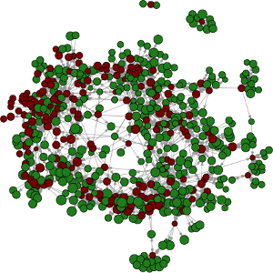

# Bayes Hack 2016

###  How can data be the difference between an economic shift and an economic win?
_Department of Labor_

## Hackers

- Ryan Brady
- Marian Farah
- Ankur Gupta
- Prakash Natarajan

## The problem

Changing demands in the economy require workers to learn, adapt, and retrain. Since the 1990s, the proportion of "middle-skill" jobs — sales, office, and administrative or factory workers — have systematically decreased in the United States. The Bureau of Labor Statistics (BLS) employment projections to 2024 provide a big picture of the growth/decline in employment by each occupation. 

An important questions to answer is what can an individual with a declining occupation outlook do to bridge the skill gap required to transfer to an occupation with a positive outlook. Furthermore, what can federal and state policymakers do to help bridge skill gaps?

## Resource

Two sources of data are used. The first is the [O*NET Resource Center](http://www.onetcenter.org/database.html?p=2), which gives detailed information about work and worker characteristics, including the skillsets most pertinent to the current middle-skill shift. The second is, the Bureau of Labor Statistics, which collects and publishes a lot of labor statistics. Specifically, [Employment Projections from 2014 to 2024](http://www.bls.gov/emp/).

## Methods

Two principal methods are developed. First, borrowing from graph theory, a directed graph structure is used to link occupations with positive outlook to occupations with poor outlook. The algorithm underlying this method attaches weights to the edges linking a poor outlook occupation to closely related positive occupations. The default binary weights are based on a relationship matrix (among occupations) provided by O*NET, but the framework allows for a 'resistance' score between 0 and 1 to indicate the ease of transition between occupations.

In general terms, the model works by treating the 2024 job projections as a 'capacity' and the ratio of 2014 employment to 2024 projections as a 'pressure'. The pressure is then distributed to adjacent nodes, with restrictions that a node starting above 1 pressure can't reduce below 1, and one starting below 1 pressure can't rise above 1. This prevents people from making more than 1 occupational shift. 

Second, a score function, based on a computed distance measure between an occupation of interest and every other occupation, is used to obtain scores that represent the ease of transitioning from the occupation of interest to the other occupations. Those scores are then ranked and the occupations with best scores are picked as the best to transition to. This score is suitable for use as a resistance in the above graph method.

## Instructions to run
Running the application requires knowledge of the shiny package in R. Instructions and tutorials can be found [here](http://shiny.rstudio.com/tutorial/lesson1/).

1. Install R studio
2. Install the following R packages - shiny, data.table, igraph, dplyr, ggplot2, stringr
3. Clone this repo
3. Run server.R in the 'shiny' folder

## License

The code is released in a GPL v3 license (as provided in LICENSE). The data was downloaded (and then processed) from various government and government-affiliated organizations [sources](http://bayeshack.org/labor.html). Please consult respective sources for possible data usage restrictions.
